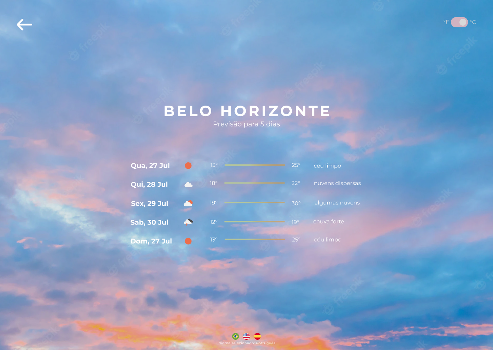
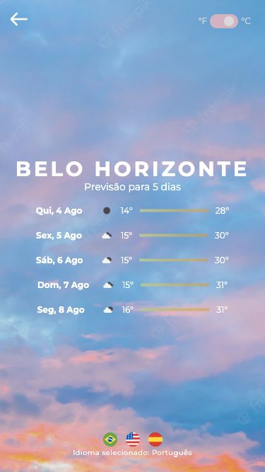
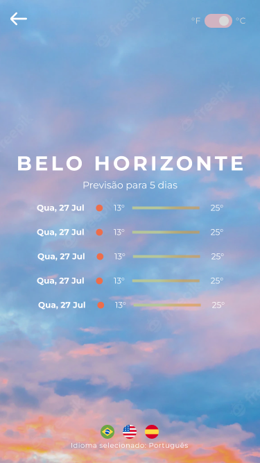

# Desafio Prático Frontend Letras - jgbpessoa

O intuito desse desafio é identificar o clima da cidade pesquisada através do Open Wheater. Lembrando que será necessário criar uma conta e uma API_KEY para conseguir consumir a API.
Lembrete: Você terá uma semana para realizar o desafio a partir da data de envio.

## Prints do App em comparação com Layout do Figma






## Regras e Funcionalidades Concluídas

- [x] Para carregar o select com os lugares, encorajamos utilizar a API do Google Places ou similar (Utilizei a API do Geoapify por ter mais familiaridade).
- [x] Os dados deverão ser printados na tela de acordo com o que vem da API.
- [x] Tratamento de erros (try catch).
- [x] Tratar internacionalização para inglês/espanhol (Todo o app está 100% funcional nas três línguas - ContextApi).
- [x] Tratar escolha de escala de grau: Celsius ou Fahrenheit (Todo o app está 100% funcional nas duas escalas - ContextApi).
- [x] Previsão do tempo para os próximos 5 dias.

### Extras

- [x] Toda a aplicação foi escrita em [Typescript](https://www.typescriptlang.org/)
- [x] Implementei um workflow do Webpack para checar regras do eslint, configs do prettier e rodar tanto em ambiente de development quanto production. Seguem os scripts abaixo:

## scripts

Para instalar todas as dependências do projeto:

```
$ npm install
```

Para rodar o ambiente de desenvolvimento iniciando o servidor local (localhost:8080):

```
$ npm start
```

Para checar o código de acordo com as rules estabelecidas no eslint:

```
$ npm run lint
```

Para formatar o código de acordo com a config do prettier estabelecida:

```
$ npm run format
```

Para fazer uma build para produção:

```
$ npm run build
```

Para testar a build em servidor local:

```
$ cd build
$ npx serve
```

### Obrigado pela oportunidade!

Coded by José Pessoa 🧪 💻
